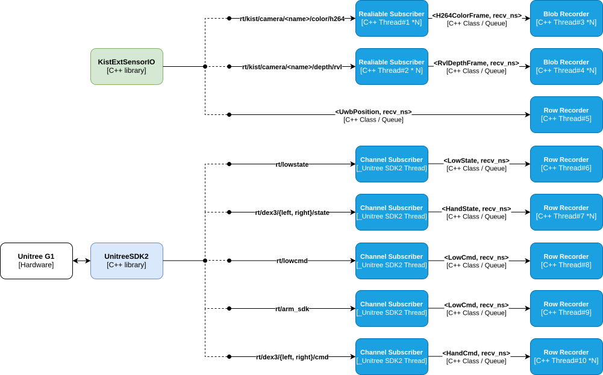

# kist-data-collector

Storage-side recorder for the KIST G1 — records the
[kist-ext-sensor-io](https://github.com/Safety-Node/kist-ext-sensor-io)
cameras (H.264 color + RVL depth), `rt/lowstate` and the Dex3 hands into one
**lossless** session. Exporters turn a session into videos or training images.

## Architecture

[](docs/kist-data-collector.svg)

## Dependencies

| Component | Version | Role |
|---|---|---|
| `kist-ext-sensor-io` | `a8de3ae` | camera wire contract (`kist_msgs` IDL, frame structs, topic names) + RVL depth decoder |
| `unitree_sdk2` | `21d0a3b` | DDS client (lowstate / Dex3 subscribers), `hg` IDL types, bundled ddsc/ddscxx runtime |
| CycloneDDS + CycloneDDS-CXX | 0.10.2 | `idlc`/`idlcxx` codegen for the camera DDS types |
| `yaml-cpp` | distro | config parsing |
| FFmpeg / libav | distro | mp4 remux + H.264 decode (exporters), `ffplay` playback |
| OpenCV | distro | depth colorize/encode, jpg/png writing (exporters) |

All of it is baked into the Docker image — the pinned repos are cloned at
image build (see Build).

## Installation

#### 1. Clone Repository

```bash
git clone https://github.com/Safety-Node/kist-data-collector.git
cd kist-data-collector
```

All following steps run from the repository root.

#### Quick Start with Docker

The image bakes in everything below (pinned thirdparty clones, toolchain,
export deps, and the build):

```bash
./docker/build.sh      # builds the image (docker build -t kist-data-collector)
./docker/run.sh        # shell in the container; prebuilt binaries under build/
                       # recordings land in $SESSIONS_DIR (default ~/kist-data-collector-sessions)
```

`run.sh` wires `--network host` (DDS), the X11 socket (`ffplay` playback),
and the `sessions/` mount. The numbered steps below are the manual
(non-Docker) alternative.

#### 2. Install apt packages

```bash
sudo apt update && sudo apt install -y \
    build-essential cmake git pkg-config \
    libyaml-cpp-dev \
    libopencv-dev libavcodec-dev libavformat-dev libavutil-dev libswscale-dev ffmpeg
```

(The last line is for the exporters/playback only — recording itself needs
none of it.)

#### 3. Install CycloneDDS (idlc toolchain)

CycloneDDS + CycloneDDS-CXX 0.10.2 into `/opt/cyclonedds`, pinned to match
the SDK's bundled `libddscxx` — same recipe as kist-ext-sensor-io's README
(step 4 there), then `export PATH=/opt/cyclonedds/bin:$PATH`.

#### 4. Clone the pinned thirdparty repos

```bash
git clone https://github.com/Safety-Node/kist-ext-sensor-io.git thirdparty/kist-ext-sensor-io
git -C thirdparty/kist-ext-sensor-io checkout a8de3ae293ab55354fc28b054146f0d040ca7e55

git clone https://github.com/unitreerobotics/unitree_sdk2.git \
    thirdparty/kist-ext-sensor-io/thirdparty/unitree_sdk2
git -C thirdparty/kist-ext-sensor-io/thirdparty/unitree_sdk2 \
    checkout 21d0a3b2c46ee48c8fdf2783becb6be3beb0a59b
```

Both clones are gitignored; the upstream is used unmodified. To move to a
newer upstream, bump `EXT_SENSOR_IO_COMMIT` (Dockerfile ARG) or the SHA
above.

## Build

With Docker, the image is already built — this is the manual path:

```bash
cmake -B build && cmake --build build
```

## Usage

Set up the config once before recording:

- `config/config.yaml` — switch streams on/off (`enabled` per section);
  camera `name`s must match the transmitter's.
- `config/cyclonedds.xml` — set the NIC (default `lo` for same-machine
  testing; the robot-LAN interface, e.g. `eno2`, for deployment).
- All keys: [docs/configuration.md](docs/configuration.md).

```bash
./build/kist_data_collector
```

Records until Ctrl-C into `sessions/<timestamp>/`, printing per-stream
status once a second; the final counters land in `meta.yaml`. After the
stop drains, one keypress labels the episode — `S` = success, `F` = fail
(Ctrl-C again skips) — written to `meta.yaml` as `result: success|fail`.

To record a single stream in isolation (same session layout, that stream
only — regardless of its `enabled` flag in the config; cameras still follow
the `realsense_cameras` list):

```bash
./build/test_realsense_recorder   # cameras only
./build/test_lowstate_recorder    # rt/lowstate only
./build/test_dex3_recorder        # Dex3 hands only
./build/test_uwb_recorder         # UWB fixes only
./build/test_cmd_recorder         # command streams only (lowcmd, arm_sdk, hand cmds)
```

## System setup

Once per storage machine, raise the kernel's receive-buffer limit so the
16 MB request in `cyclonedds.xml` can take effect:

```bash
sudo tee /etc/sysctl.d/99-dds-buffers.conf <<'EOF'
net.core.rmem_max = 134217728
EOF
sudo sysctl --system
```

## Storage format

One directory per recording session:

```
sessions/<YYYYMMDD_HHMMSS>/
  meta.yaml                  # session times + per-stream counters
  lowstate.csv               # robot state, one row per message
  hand_left.csv hand_right.csv
  uwb.csv
  <camera>/
    color.h264  color.idx.csv    # compressed payloads verbatim,
    depth.rvl   depth.idx.csv    #   one CSV index per stream
```

Every file shares the `recv_ns` column (arrival clock, epoch ns) for
cross-stream alignment. Field-level schemas, format rationale and the
alternatives considered: [docs/storage-format.md](docs/storage-format.md).

## Exporting

```bash
./build/export_session_mp4    <session_dir>   # playable videos
./build/export_session_images <session_dir>   # per-frame training images
```

- `export_session_mp4` → `<camera>/color.mp4` + `<camera>/depth.mp4`
  (depth is a colorized preview).
- `export_session_images` → `<camera>/color_jpg/<seq>.jpg` +
  `<camera>/depth_png/<seq>.png` (16-bit; pixel × `depth_scale` = meters).
  The same `<seq>` in both names is the same captured frame.

Both convert every camera in the session at once.
